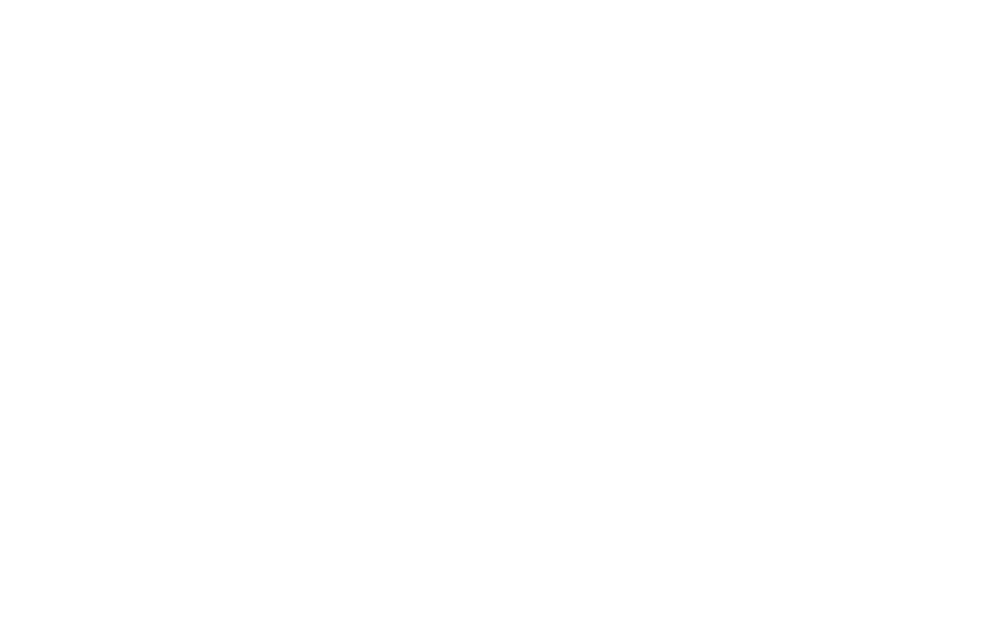
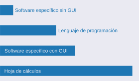
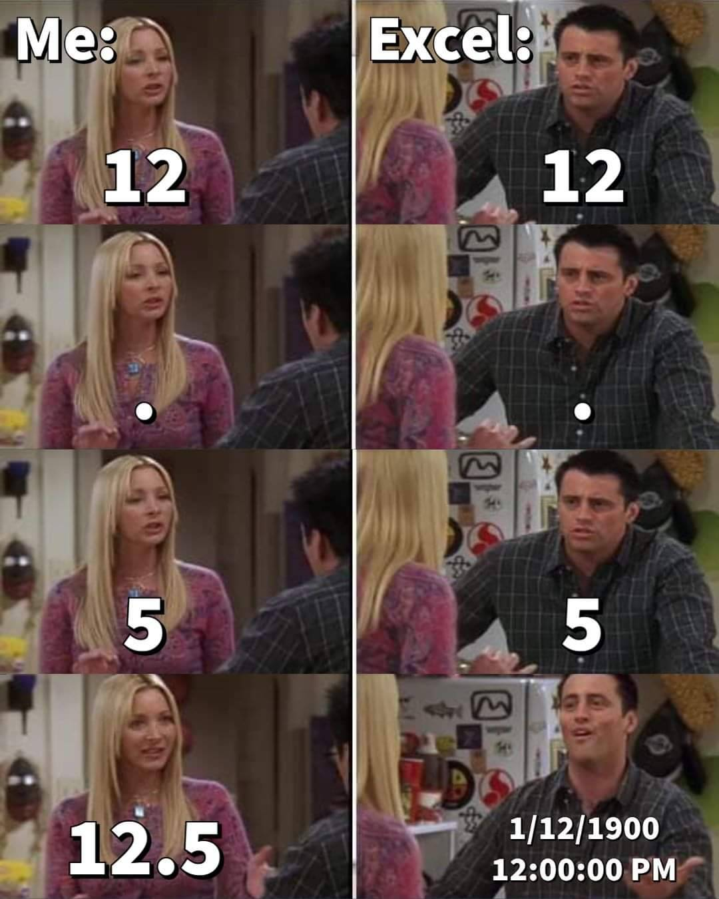
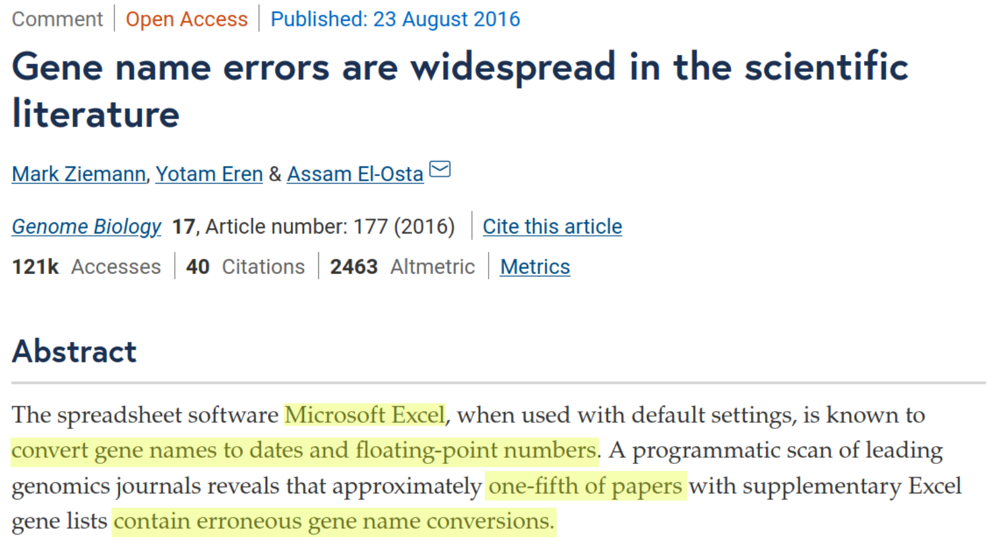
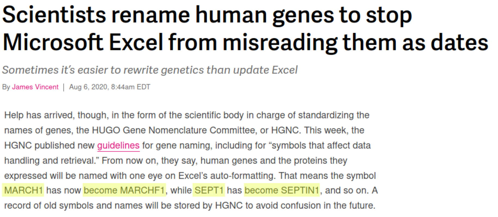
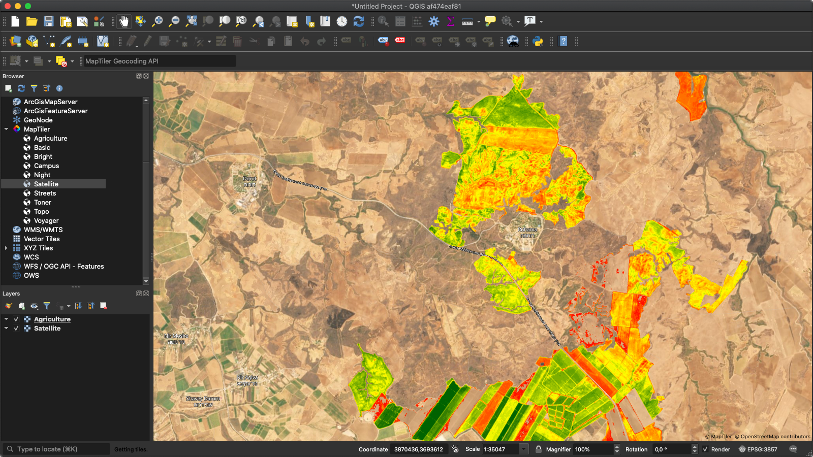
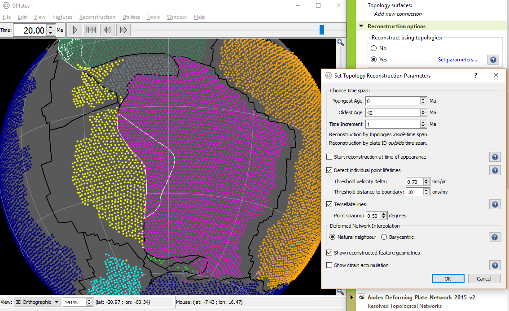

<!-- .slide: class="slide-title" -->

# Herramientas computacionales para Geociencias

## [Santiago Soler](https://santisoler.github.io)

[*CONICET, Argentina*](https://www.conicet.gov.ar/)
 
[*Instituto Geofísico y Sismológico Volponi, UNSJ, Argentina*](http://igsv.unsj.edu.ar/)
 
[*Computer-Oriented Geoscience Lab*](https://www.compgeolab.org/)

<a href="">

Universidad Nacional del Sur   SEG Student Chapter

</a>

---

Pueden ver las slides en:

https://santisoler.github.io/seg-uns-2020

<i class="fab fa-creative-commons"></i><i class="fab fa-creative-commons-by"></i>

---

# ¿Quién soy?

* Licenciado en Física (UNR)
* Estudiante de Doctorado en Geofísica (UNSJ)
* Becario Doctoral de CONICET, trabajando en el IGSV
* Desarrollador de [Fatiando a Terra](https://www.fatiando.org)
* Miembro de [Computer-Oriented Geoscience Lab](https://www.compgeolab.org)

---

# Trabajar como Geocientista

---

# Industria

* **Objetivo:** Exploración de recursos naturales
* **Produce:** Recursos naturales para su consumo

---

# Academia

* **Objetivo:** Generar nuevos conocimientos
* **Produce:** Artículos científicos

---

# Comparten un flujo de trabajo

<ol>
<li>Datos</li>
<li class="fragment highlight-blue">Visualización, procesamiento, modelado</li>
<li>Resultados</li>
<li>Conclusiones</li>
</ol>

---

# ¿Qué herramientas podemos usar?

---

## Encuesta en curso de Python

---

# Hojas de cálculo

## Ventajas

* Fácil de usar
* Accesibles

## Desventajas

* Susceptibles a errores

---

---

Microsoft Excel convierte nombres de genes a fechas y números.
 
Un quinto de los papers contienen conversiones erróneas de genes.

Ziemann, Eren & El-Osta (2016).
doi: [10.1186/s13059-016-1044-7](https://doi.org/10.1186/s13059-016-1044-7)

---

---

Renombran genes para evitar que Excel los lea como fechas.

https://www.theverge.com/2020/8/6/21355674/human-genes-rename-microsoft-excel-misreading-dates

---

Opinión personal:

<blockquote>
Que la tecnología se adapte a nosotres y no nosotres a ella.
</blockquote>

---

Más ejemplos

<iframe
    width="1600"
    height="900"
    src="https://www.youtube-nocookie.com/embed/yb2zkxHDfUE?start=58"
    frameborder="0"
    allow="accelerometer; autoplay; encrypted-media; gyroscope; picture-in-picture" allowfullscreen
></iframe>

---

# ¿Qué alternativas tenemos?

<h2 class="fragment fade-in">
Software para procesamiento de datos
</h2>

---

<!-- .slide: data-auto-animate -->

<h2 data-id="soft-privativo">Software privativo</h2>

## Software Open-Source

---

<!-- .slide: data-auto-animate -->

<h2 data-id="soft-privativo">Software privativo</h2>

<ul>
<li class="fragment fade-in">Soluciones terminadas</li>
<li class="fragment fade-in">Soporte y garantías</li>
<li class="fragment fade-in">Código cerrado</li>
<li class="fragment fade-in">Pago de licencias de uso</li>
<li class="fragment fade-in">Limitaciones para innovar</li>
<li class="fragment fade-in">Difícil implementar nuevas ideas</li>
</ul>

---

## Software Open-Source

<ul>
<li class="fragment fade-in">Libertad de <b>usar</b>, <b>compartir</b>, <b>modificar</b></li>
<li class="fragment fade-in">Bajos costos</li>
<li class="fragment fade-in">Nuevas metodologías a partir de las existentes</li>
<li class="fragment fade-in">Posibilidad de innovar</li>
<li class="fragment fade-in">Reproducibilidad y accesibilidad</li>
<li class="fragment fade-in">Comunidad internacional</li>
</ul>

---

# Herramientas Open-Source en Geociencias

---

## Con interfaz gráfica

* QGIS
* OpendTect
* GPlates

---

Ejemplo: QGIS

---

Ejemplo: GPlates

---

## Sin interfaz gráfica

* GMT (Generic Mapping Tool)
* Seismic Unix
* ASPECT
* Madagascar

---

<!-- .slide: data-auto-animate -->

Ejemplo: GMT

<pre class="bash">
<code class="r-stretch">#!/usr/bin/env bash
#		GMT EXAMPLE 02
#
# Purpose:	Make two color images based gridded data
# GMT modules:	set, grd2cpt, grdimage, makecpt, colorbar, subplot
#
gmt begin ex02
	gmt set MAP_ANNOT_OBLIQUE separate
	gmt subplot begin 2x1 -A+JTL -Fs16c/9c -M0 -R160/20/220/30+r -JOc190/25.5/292/69/16c -B10 -T"H@#awaiian@# T@#opo and @#G@#eoid@#"
		gmt subplot set 0,0 -Ce3c
		gmt grd2cpt @HI_topo_02.nc -Crelief -Z
		gmt grdimage @HI_topo_02.nc -I+a0
		gmt colorbar -DJRM+o1.5c/0+mc -I0.3 -Bx2+lTOPO -By+lkm

		gmt subplot set 1,0 -Ce3c
		gmt makecpt -Crainbow -T-2/14/2
		gmt grdimage @HI_geoid_02.nc
		gmt colorbar -DJRM+o1.5c/0+e+mc -Bx2+lGEOID -By+lm
	gmt subplot end
gmt end show
</code></pre>

https://docs.generic-mapping-tools.org/6.1/gallery/ex02.html1

---

<!-- .slide: data-auto-animate -->

Ejemplo: GMT

---

<h1 data-id="title">Lenguajes de programación</h1>

Instrucciones para realizar las tareas que deseamos

---

## ¿Por qué estos lenguajes?

Multipropósito

Estadística

Análisis numérico

---

<!-- .slide: class="slide-light" data-background-color="#FAFAFA" -->

## Librerías

---

<!-- .slide: data-auto-animate -->

**Ejemplo:** Grillar Datos Aeromagnéticos

<pre class="python">
<code
    style="max-height: 800px"
    data-line-numbers="|1-5|8-9|11-14|16-17|19-20|22-23|26-28"
>import matplotlib.pyplot as plt
import numpy as np
import pyproj
import verde as vd
import harmonica as hm

# Fetch the sample total-field magnetic anomaly data from Great Britain
data = hm.datasets.fetch_britain_magnetic()

# Project coordinates
projection = pyproj.Proj(proj="merc", lat_ts=data.latitude.mean())
easting, northing = projection(data.longitude.values, data.latitude.values)
coordinates = (easting, northing, data.altitude_m)

# Create the equivalent layer.
eql = hm.EQLHarmonic(relative_depth=1000, damping=1)

# Fit the layer coefficients to the observed magnetic anomaly.
eql.fit(coordinates, data.total_field_anomaly_nt)

# Interpolate data on a regular grid
grid = eql.grid(spacing=500, data_names=["magnetic_anomaly"], extra_coords=1500)

# Plot original data and the gridded version
fig, (ax1, ax2) = plt.subplots(nrows=1, ncols=2, figsize=(12, 9), sharey=True)
...
</pre></code>

https://www.fatiando.org/harmonica/v0.1.0/gallery/eql/harmonic.html#sphx-glr-gallery-eql-harmonic-py

---

<!-- .slide: data-auto-animate -->

**Ejemplo:** Grillar Datos Aeromagnéticos

https://www.fatiando.org/harmonica/v0.1.0/gallery/eql/harmonic.html#sphx-glr-gallery-eql-harmonic-py

---

# Awesome Open Geoscience

<i class="fab fa-github"></i> [softwareunderground/awesome-open-geoscience](https://github.com/softwareunderground/awesome-open-geoscience)

---

## ¿Necesito ser experto/a programador/a?

¡No!

- No hacen falta años de experiencia
- Documentación extensa
- Ejemplos
- Tutoriales
- Comunidades

---

# Documentación y Ejemplos

---

<!-- .slide: data-background-image="images/verde-docs-home.png" data-background-size="contain" -->

---

<!-- .slide: data-background-image="images/verde-docs-coords.png" data-background-size="contain" -->

---

<!-- .slide: data-background-image="images/verde-gallery.png" data-background-size="contain" -->

---

# Tutoriales

---

<iframe
    width="1600"
    height="900"
    src="https://www.youtube-nocookie.com/embed/jZ7Sj9cnnso"
    frameborder="0"
    allow="accelerometer; autoplay; encrypted-media; gyroscope; picture-in-picture"
    allowfullscreen
></iframe>

L. Heagy (2020). Tutorial: Geophysical Inversion in SimPEG. Transform2020.

---

# Comunidades

---

https://softwareunderground.org/

---

# ¿Vale la pena aprender a programar como geocientista?

---

<!--
.slide: data-background-image="images/agile-website.png" data-background-size="contain" data-background-color="#FFFFFF"
-->

---

Inserción en otros ámbitos:

# Data Science

---

<!-- .slide: data-auto-animate -->

# Reproducibilidad en Ciencia

---

<!-- .slide: data-auto-animate -->

# Reproducibilidad en Ciencia

Baker, M. (2016). 1500 scientists lift the lid on reproducibility.
doi: [10.1038/533452a](https://doi.org/10.1038/533452a)

---

Una parte de la solución:

# Compartir datos

# +

# Compartir código

---

# Publicar Software

---

<!-- .slide: data-background-color="#FAFAFA" -->

https://joss.theoj.org/

---

<blockquote class="twitter-tweet">
La computadora es una herramienta demasiado poderosa como para resignarse
a utilizar únicamente programas hechos por otres. La capacidad de desarrollar
software *debe* ser democratizada, por mucho que les pese a algunes
"expertes".
&mdash; <a href="https://twitter.com/PabloAlcain">@PabloAlcain</a>,
<a href="https://twitter.com/PabloAlcain/status/1183464809406357505?ref_src=twsrc%5Etfw">
Octubre 13, 2019
</a>
</blockquote>

---

# Contacto

<ul class="fa-ul" style="">
<li><i class="fa-li fa fa-envelope"></i>

[santiago.r.soler@gmail.com](mailto:santiago.r.soler@gmail.com)

</li>
<li><i class="fa-li fab fa-twitter"></i>

[@santirsoler](https://twitter.com/santirsoler)

</li>
<li><i class="fa-li fa fa-globe-americas"></i>

[santisoler.github.io](https://santisoler.github.io)

</li>
</ul>

---

<!-- .slide: class="slide-license" -->

<i class="fab fa-creative-commons"></i><i class="fab fa-creative-commons-by"></i>

El contenido de esta presentación está disponible bajo

[Creative Commons Attribution 4.0 International License](https://creativecommons.org/licenses/by/4.0/)

---

<!-- .slide: class="slide-title" -->

# Muchas gracias
